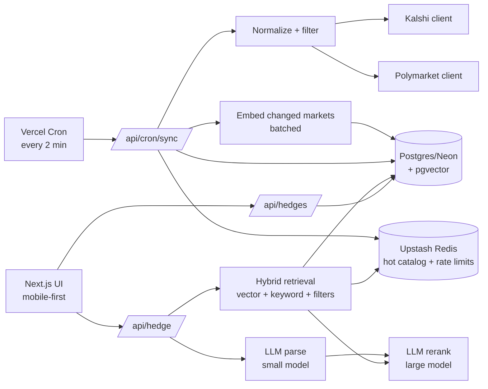

# Architecture

Hedgehog turns a plain-English risk into a sized hedge on a live prediction
market. The controlling principle: **the request path never calls providers.**
A cron-driven sync keeps Postgres + Redis warm; user requests read only our own
stores. The single exception is the live single-market price on the proposal card.

## Request pipeline (`/api/hedge`)

1. **Parse** (small model) → `HedgeSpec` (Zod, retry-on-invalid).
2. In parallel with parse: **warm-up** the Redis catalog read.
3. **Hybrid retrieve**: pgvector cosine + keyword + hard filters → dedupe → top 15.
4. **Rerank** (large model) → up to 3 matches with the correct hedging side.
5. **Propose**: hedge math (`src/shared/hedgeMath.ts`) + response assembly.

Every stage has a tested degraded mode (see the ADRs and spec §6.3).

## Code map

- `src/config/env.ts` — validated env, fail-fast.
- `src/server/providers/` — Kalshi + Polymarket clients behind one interface.
- `src/server/pipeline/` — parse · embed · retrieve · rank · propose.
- `src/server/{sync,db,cache,http}.ts` — background sync + datastore + hardening.
- `src/shared/` — Zod schemas + pure hedge math.
- `src/features/` — feature-slice UI (ask · hedge · hedges).

See `docs/adr/` for decisions and `docs/PITFALLS.md` before making changes.
